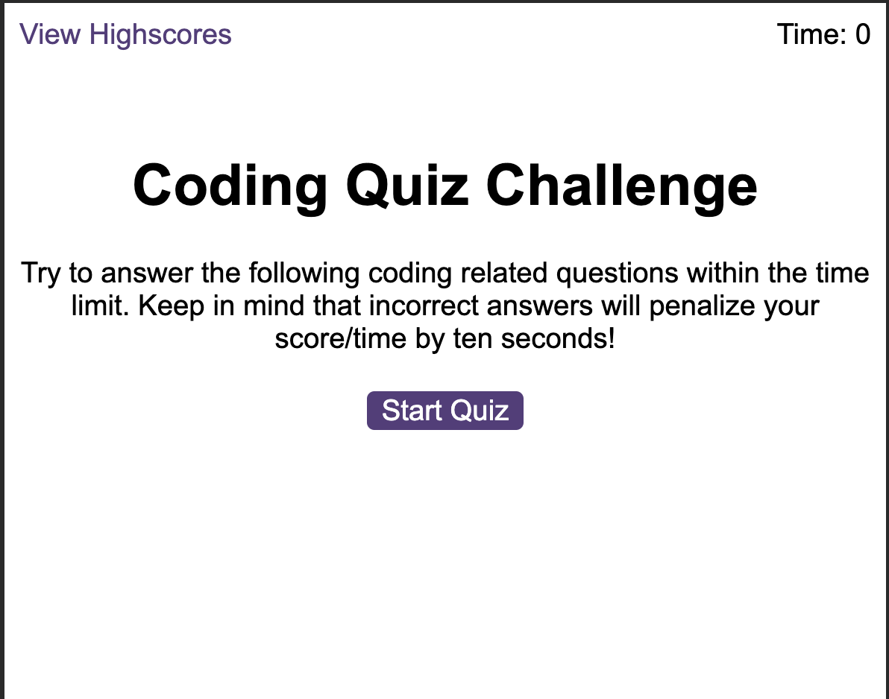
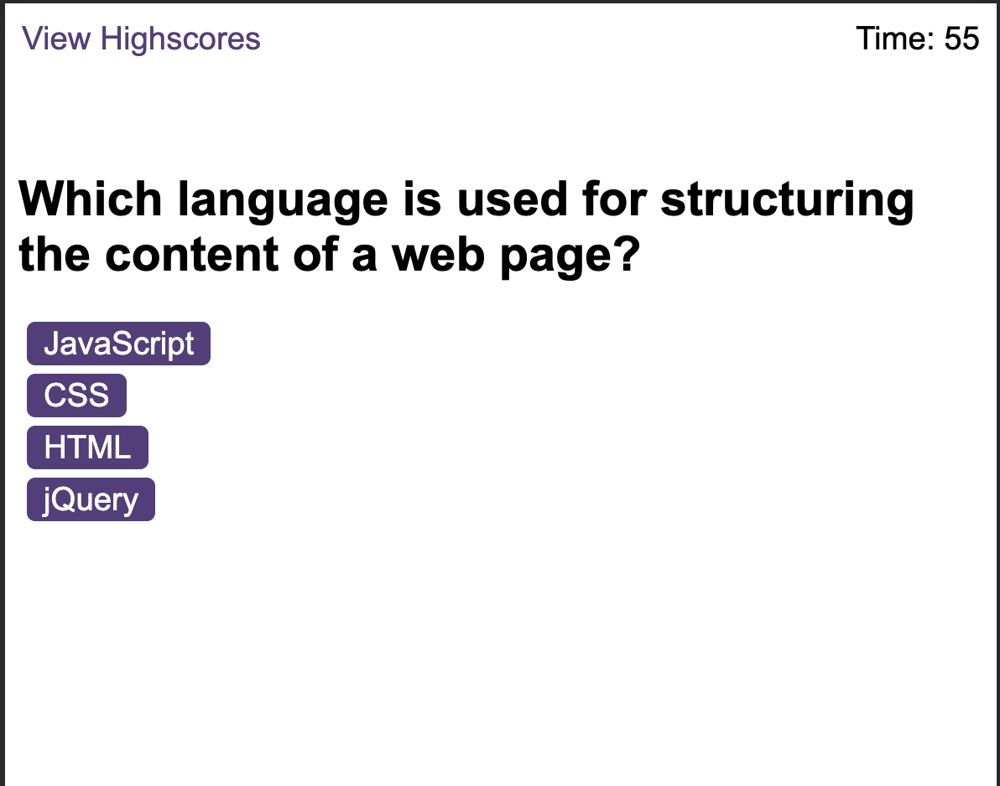

# codeQuiz-C-6

## Description 
I have been tasked with creating a timed coding quiz with multiple-choice questions. 

## Acceptance Criteria

Create a code quiz that contains the following requirements:

* A start button that when clicked a timer starts and the first question appears.
 
  * Questions contain buttons for each answer.
  * 
  * When answer is clicked, the next question appears
  * 
  * If the answer clicked was incorrect then subtract time from the clock

* The quiz should end when all questions are answered or the timer reaches 0.

  * When the game ends, it should display their score and give the user the ability to save their initials and their score
  
## Mock-Up

The following animation demonstrates the application functionality:

  

## Completed Quiz Screenshots

## References
[Javascript.info](https://javascript.info/)
[W3Schools](https://www.w3schools.com/js/)
[MDN](https://developer.mozilla.org/en-US/docs/Web/JavaScript/Guide)

## Deployed Project Link 
(https://hwilson-hub.github.io/codeQuiz-C-6/)

## License

This project is licensed under the MIT License
©2023. Haydawn Wilson. All Rights Reserved.
